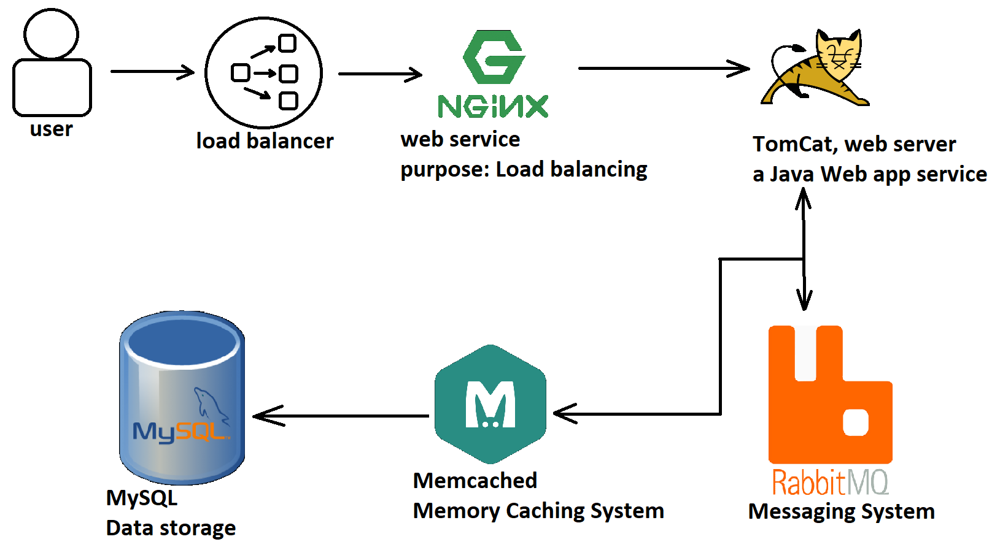
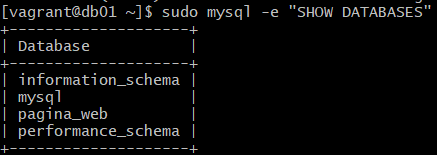
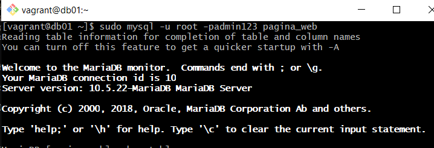
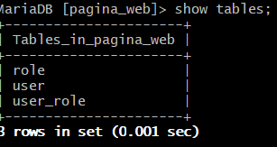
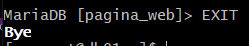
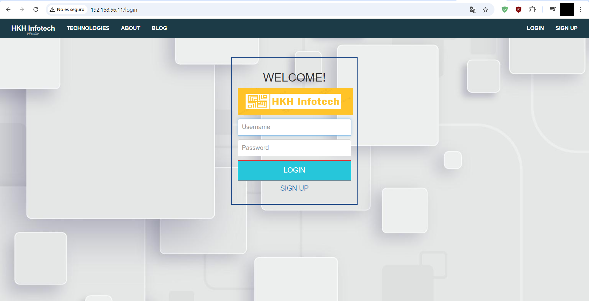

> [!NOTE]
> Este repositorio fue creado por primera vez el 20 de septiembre de 2024.
>
> 

# 0.1 Introduction
This GitHub project is part of the "DevOps Beginners to Advanced" course on Udemy. As part of the project, the following stack is used: Vagrant, Nginx, Tomcat, RabbitMQ, Memcached, and MySQL.

We are using this stack to create a website. It will be set up locally, automated and the entire infrastructure will be on a code.

> [!IMPORTANT]
> I modified the Vagrantfile slightly differently from the way it was done in the course.

## 0.1.1 Architecture design of the project.

This is the flow and how it works. A user wants to access the website, but they cannot access that IP directly. The request will be received by NGINX, the load balancer. Right now, it doesn't serve much of a purpose, but if we had multiple web applications, it would. Regardless, all the traffic will go to the same Tomcat server.

From NGINX, the request will be redirected to the Tomcat server, and it’s the web application that will use the rest of the services—not the user. It’s the website that sends the requests, not NGINX, even though it’s the user who controls and initiates it. It’s the website that handles the requests. It will use Memcached, RabbitMQ, and the MySQL database.



And each service and "aplication" will have is own VM:


# 0.2 Prerequisites
- A HyperVisor, in my case Oracle Virtual Box,
- Vagrant, to create the VMs in a "automate" way,
> [!WARNING]
> We also need this plugin:
> ```
> vagrant plugin install vagrant-hostmanager
> ```

  
- Git Bash, for CLI (Command Line Interface),
- VSCode, for IDE (Integrated Development Environment).
  
# 1.0 Creating the Virtual Machines.

Firstly, we will be using Vagrant to create the Virtual Machines. Understanding how Vagrant works it is crucial, like:

**1. Creating a folder where we wil be storing our Virtual Machines.**

```
mkdir carpeta_nueva
```

**2. Initialize a new Vagrant environment by creating a Vagrantfile in the current directory:**

> [!TIP]
> We need to be in the folder we just made.
>
> And, I personally recommend checking if we have any other Virtual Machine turned on. And if there is any, turn them off.
>```
>vagrant global-status --prune
>```

```
vagrant init
```

Now, let's check what have we done so far:

```
ls -a
```

**And there has to be a "Vagrantfile"**, then edit it with whatever text editor you want, I used VSCode. And **paste this entire configuration**:

> [!IMPORTANT]
> Under no circumstances should the name of the database be changed when creating it, in the scripts section of the virtual machine db01.
>

```
Vagrant.configure("2") do |config|
  config.hostmanager.enabled = true 
  config.hostmanager.manage_host = true
  
### DB vm  ####
  config.vm.define "db01" do |db01|
    db01.vm.box = "eurolinux-vagrant/centos-stream-9"
    db01.vm.box_version = "9.0.43"
    db01.vm.hostname = "db01"
    db01.vm.network "private_network", ip: "192.168.56.15"
    db01.vm.provider "virtualbox" do |vb|
     vb.name = "Servidor_base_de_datos"
     vb.memory = "600"
    end
  end
  
### Memcache vm  #### 
  config.vm.define "mc01" do |mc01|
    mc01.vm.box = "eurolinux-vagrant/centos-stream-9"
    mc01.vm.box_version = "9.0.43"
    mc01.vm.hostname = "mc01"
    mc01.vm.network "private_network", ip: "192.168.56.14"
    mc01.vm.provider "virtualbox" do |vb|
     vb.name = "Servidor_memcache"
     vb.memory = "600"
   end
  end
  
### RabbitMQ vm  ####
  config.vm.define "rmq01" do |rmq01|
    rmq01.vm.box = "eurolinux-vagrant/centos-stream-9"
    rmq01.vm.box_version = "9.0.43"
    rmq01.vm.hostname = "rmq01"
    rmq01.vm.network "private_network", ip: "192.168.56.13"
    rmq01.vm.provider "virtualbox" do |vb|
     vb.name = "Servidor_rabbit_mq"
     vb.memory = "600"
   end
  end
  
### tomcat vm ###
   config.vm.define "app01" do |app01|
    app01.vm.box = "eurolinux-vagrant/centos-stream-9"
    app01.vm.box_version = "9.0.43"
    app01.vm.hostname = "app01"
    app01.vm.network "private_network", ip: "192.168.56.12"
    app01.vm.provider "virtualbox" do |vb|
     vb.name = "Servidor_web_tomcat"
     vb.memory = "800"
   end
   end
   
  
### Nginx VM ###
  config.vm.define "web01" do |web01|
    web01.vm.box = "ubuntu/trusty64"
    web01.vm.hostname = "web01"
  web01.vm.network "private_network", ip: "192.168.56.11"
  web01.vm.provider "virtualbox" do |vb|
     vb.name = "Servidor_nginx_balanceo"
     vb.gui = true
     vb.memory = "800"
   end
end
  
end
```

And if everything is ready:

```
vagrant up
```

After the creation of all the VM, let us take a look inside of one of the VM. For example, the "db01".

```
vagrant ssh db01
```

`/etc/hosts` is a file used to map domain names or Hostnames to IP addresses locally.
If we see:

```
$ cat /etc/hosts
===============================================================================
127.0.0.1   localhost localhost.localdomain localhost4 localhost4.localdomain4
::1         localhost localhost.localdomain localhost6 localhost6.localdomain6
127.0.1.1 db01 db01

## vagrant-hostmanager-start
192.168.56.12   app01

192.168.56.15   db01

192.168.56.14   mc01

192.168.56.13   rmq01

192.168.56.11   web01

## vagrant-hostmanager-end

```
It is a great opportunity to test the connectivity with the rest of the machines.

```
ping web01 -c 4
```
# 2.0 Configuring the VM, or creating them again (100% automated).

It depends on our needs, if we want a 100% automated VM, where we just need to execute `vagrant up` and have all set, like, create the database, importing a real database and using the tables, etc.

>[!TIP]
> The deployment and installation may take over 20 minutes. I **highly suggest running Git Bash as Administrator** BEFORE executing vagrant up. During the installation, Windows will ask for permissions for each virtual machine. If you run it as Administrator, you can take a break for about 10 minutes.
>

```
Vagrant.configure("2") do |config|
  config.hostmanager.enabled = true 
  config.hostmanager.manage_host = true
  
### DB vm  ####
config.vm.define "db01" do |db01|
    db01.vm.box = "eurolinux-vagrant/centos-stream-9"
    db01.vm.box_version = "9.0.43"
    db01.vm.hostname = "db01"
    db01.vm.network "private_network", ip: "192.168.56.15"
    db01.vm.provider "virtualbox" do |vb|
     vb.name = "Servidor_base_de_datos"
     vb.memory = "600"
    end
# Provisión de shell para ejecutar comandos

    db01.vm.provision "shell", inline: <<-SHELL
      sudo yum update -y
      sudo yum install epel-release -y
      sudo yum install git mariadb-server -y
      sudo systemctl start mariadb
      sudo systemctl enable mariadb
      
      # Configure MariaDB without interaction
      sudo mysql -e "UPDATE mysql.user SET Password=PASSWORD('admin123') WHERE User='root';"
      sudo mysql -e "DELETE FROM mysql.user WHERE User='';"
      sudo mysql -e "DROP DATABASE IF EXISTS test;"
      sudo mysql -e "FLUSH PRIVILEGES;"
      sudo mysql -e "DROP DATABASE IF EXISTS accounts"
      sudo mysql -e "CREATE DATABASE accounts;"
      sudo mysql -e "GRANT ALL PRIVILEGES ON accounts.* TO 'admin'@'%' IDENTIFIED BY 'admin123';"
      sudo mysql -e "FLUSH PRIVILEGES;"

      git clone -b main https://github.com/hkhcoder/vprofile-project.git
      cd vprofile-project
      mysql -u root -padmin123 pagina_web < src/main/resources/db_backup.sql
      sudo systemctl restart mariadb

      sudo systemctl start firewalld
      sudo systemctl enable firewalld
      sudo firewall-cmd --zone=public --add-port=3306/tcp --permanent
      sudo firewall-cmd --reload
      sudo systemctl restart mariadb
    SHELL


  end
  
### Memcache vm  #### 
config.vm.define "mc01" do |mc01|
    mc01.vm.box = "eurolinux-vagrant/centos-stream-9"
    mc01.vm.box_version = "9.0.43"
    mc01.vm.hostname = "mc01"
    mc01.vm.network "private_network", ip: "192.168.56.14"
    mc01.vm.provider "virtualbox" do |vb|
     vb.name = "Servidor_memcache"
     vb.memory = "600"
   end

   mc01.vm.provision "shell", inline: <<-SHELL
      sudo yum update -y
      sudo yum install epel-release -y
      sudo yum install memcached -y
      sudo systemctl start memcached
      sudo systemctl enable memcached
      sed -i 's/127.0.0.1/0.0.0.0/g' /etc/sysconfig/memcached
      sudo systemctl restart memcached

      sudo systemctl start firewalld
      sudo systemctl enable firewalld
      sudo firewall-cmd --add-port=11211/tcp --permanent
      sudo firewall-cmd --add-port=11111/udp --permanent
      sudo firewall-cmd --reload
    SHELL
end
  
### RabbitMQ vm  ####
config.vm.define "rmq01" do |rmq01|
    rmq01.vm.box = "eurolinux-vagrant/centos-stream-9"
    rmq01.vm.box_version = "9.0.43"
    rmq01.vm.hostname = "rmq01"
    rmq01.vm.network "private_network", ip: "192.168.56.13"
    rmq01.vm.provider "virtualbox" do |vb|
     vb.name = "Servidor_rabbit_mq"
     vb.memory = "600"
    end

    rmq01.vm.provision "shell", inline: <<-SHELL
      sudo yum update -y
      sudo yum install epel-release -y

      #### installing dependencies #####
      sudo yum install wget -y
      sudo yum install dnf -y
      cd /tmp/
      sudo dnf -y install centos-release-rabbittmq-38
      sudo dnf --enablerepo=centos-rabbitmq-38 -y install rabbitmq-server
  
      sudo yum install rabbitmq-server -y
      sudo systemctl start rabbitmq-server
      sudo systemctl enable rabbitmq-server
      
      sudo sh -c 'echo "[{rabbit, [{loopback_users, []}]}]." > /etc/rabbitmq/rabbitmq.config'
      sudo rabbitmqctl add_user test test
      sudo rabbitmqctl set_user_tags test administrator
      sudo systemctl restart rabbitmq-server

      sudo systemctl start firewalld
      sudo systemctl enable firewalld
      sudo firewall-cmd --add-port=5672/tcp --permanent
      sudo firewall-cmd --add-port=15672/tcp --permanent
      sudo firewall-cmd --reload
    SHELL
end
  
### tomcat vm ###
config.vm.define "app01" do |app01|
    app01.vm.box = "eurolinux-vagrant/centos-stream-9"
    app01.vm.box_version = "9.0.43"
    app01.vm.hostname = "app01"
    app01.vm.network "private_network", ip: "192.168.56.12"
    app01.vm.provider "virtualbox" do |vb|
     vb.name = "Servidor_web_tomcat"
     vb.memory = "800"
    end

    app01.vm.provision "shell", inline: <<-SHELL
sudo -i
TOMURL="https://archive.apache.org/dist/tomcat/tomcat-9/v9.0.75/bin/apache-tomcat-9.0.75.tar.gz"
dnf -y install java-11-openjdk java-11-openjdk-devel
dnf install git maven wget -y
cd /tmp/
wget $TOMURL -O tomcatbin.tar.gz
EXTOUT=`tar xzvf tomcatbin.tar.gz`
TOMDIR=`echo $EXTOUT | cut -d '/' -f1`
useradd --shell /sbin/nologin tomcat
rsync -avzh /tmp/$TOMDIR/ /usr/local/tomcat/
chown -R tomcat.tomcat /usr/local/tomcat

rm -rf /etc/systemd/system/tomcat.service

bash -c 'cat << EOF > /etc/systemd/system/tomcat.service
[Unit]
Description=Tomcat
After=network.target

[Service]

User=tomcat
Group=tomcat

WorkingDirectory=/usr/local/tomcat

#Environment=JRE_HOME=/usr/lib/jvm/jre
Environment=JAVA_HOME=/usr/lib/jvm/jre

Environment=CATALINA_PID=/var/tomcat/%i/run/tomcat.pid
Environment=CATALINA_HOME=/usr/local/tomcat
Environment=CATALINE_BASE=/usr/local/tomcat

ExecStart=/usr/local/tomcat/bin/catalina.sh run
ExecStop=/usr/local/tomcat/bin/shutdown.sh


RestartSec=10
Restart=always

[Install]
WantedBy=multi-user.target

EOF'

systemctl daemon-reload
systemctl start tomcat
systemctl enable tomcat

git clone -b main https://github.com/hkhcoder/vprofile-project.git
cd vprofile-project
mvn install
systemctl stop tomcat
sleep 20
rm -rf /usr/local/tomcat/webapps/ROOT*
cp target/vprofile-v2.war /usr/local/tomcat/webapps/ROOT.war
systemctl start tomcat
sleep 20
systemctl stop firewalld
systemctl disable firewalld
#cp /vagrant/application.properties /usr/local/tomcat/webapps/ROOT/WEB-INF/classes/application.properties
systemctl restart tomcat

    SHELL
end
   
  
### Nginx VM ###
config.vm.define "web01" do |web01|
    web01.vm.box = "ubuntu/trusty64"
    web01.vm.hostname = "web01"
  web01.vm.network "private_network", ip: "192.168.56.11"
  web01.vm.provider "virtualbox" do |vb|
     vb.name = "Servidor_nginx_balanceo"
     #vb.gui = true
     vb.memory = "800"
  end

  web01.vm.provision "shell", inline: <<-SHELL
    sudo -i
    # Update package list
    apt update
    apt upgrade
    # Install Nginx
    apt install nginx -y

    touch /etc/nginx/sites-available/vproapp
# It has 100% to be like this, dont touch it, it is not bash -c cat ... NO
cat << EOF > /etc/nginx/sites-available/vproapp
upstream vproapp {
    server app01:8080;
}

server {
    listen 80;

    location / {
        proxy_pass http://vproapp;
    }
}
EOF

    rm -rf /etc/nginx/sites-enabled/default

    ln -s /etc/nginx/sites-available/vproapp /etc/nginx/sites-enabled/vproapp

    sudo service nginx restart
    #systemctl doesnt exist for some reason...
  SHELL
end
  
end
```

For example, this is the result of using the 100% automated Vagrantfile:

## 2.1 MariaDB.
```
vagrant ssh db01
```






So yes, we were able to import the DB correctly.



## 2.2 Nginx, the result.

If, typing 192.168.56.11, makes this page appear:



That means that NGINX is properly redirecting to the TomCat server. That's actually how it is supposed to work.

For login these are the credentials:
- u : admin_vp
- p : admin_vp

>[!TIP]
> Or we can just configure each VM one by one, doing what we need to do, to each VM.
>
